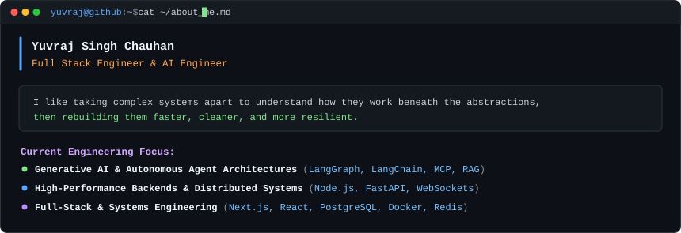

<div align="center">

<h3><code>yuvraj@github ~ $ whoami --extended</code></h3>

<table border="0" cellpadding="0" cellspacing="0">
  <tr>
    <td width="370" valign="top" align="center">
      
    </td>
    <td width="10"></td>
    <td width="490" valign="top" align="center">
      
    </td>
  </tr>
</table>

<br>

<h3><code>yuvraj@github ~ $ git log --contributions --graph --stat</code></h3>


<br>

<h3><code>yuvraj@github ~ $ cat skills.txt</code></h3>


<br>

<h3><code>yuvraj@github ~ $ cat ~/about_me.md</code></h3>



</div>

<br>

### <code>yuvraj@github ~ $ netstat --listening-endpoints</code>

```text
PROTO  LOCAL_ADDRESS          SERVICE      ACTION / LINK
tcp    0.0.0.0:22             ssh          git@github.com:RgbGuy-Yx
tcp    0.0.0.0:443            email        mailto:ys0609392@gmail.com
tcp    0.0.0.0:8080           social       https://instagram.com/yuvies.45
```

<br>

---

<div align="center">
<sub>Rendered locally & automatically synchronized via <a href=".github/workflows/update-profile-art.yml">GitHub Actions</a> • Zero external shield dependencies</sub>
</div>
