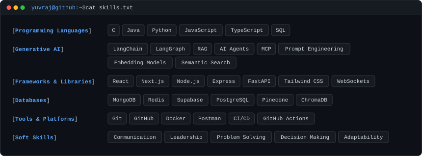

<div align="center">

<h3><code>yuvraj@github ~ $ whoami --extended</code></h3>

<table border="0" cellpadding="0" cellspacing="0">
  <tr>
    <td width="370" valign="top" align="center">
      
    </td>
    <td width="10"></td>
    <td width="490" valign="top" align="center">
      
    </td>
  </tr>
</table>

<br>

<h3><code>yuvraj@github ~ $ git log --contributions --graph --stat</code></h3>



<br>

<h3><code>yuvraj@github ~ $ cat skills.txt</code></h3>



</div>

<br>
<br>

### <code>yuvraj@github ~ $ cat ~/about_me.md</code>

```text
> Yuvraj Singh Chauhan
> Full Stack Engineer & AI Agent Architect

I like taking complex systems apart to understand how they work beneath the abstractions, 
then rebuilding them faster, cleaner, and more resilient.

Current Engineering Focus:
• Generative AI & Autonomous Agent Architectures (LangGraph, LangChain, MCP, RAG)
• High-Performance Backends & Distributed Systems (Node.js, FastAPI, WebSockets)
• Full-Stack & Systems Engineering (Next.js, React, PostgreSQL, Docker, Redis)


<div align="center">
<sub>Rendered locally & automatically synchronized via <a href=".github/workflows/update-profile-art.yml">GitHub Actions</a> • Zero external shield dependencies</sub>
</div>
